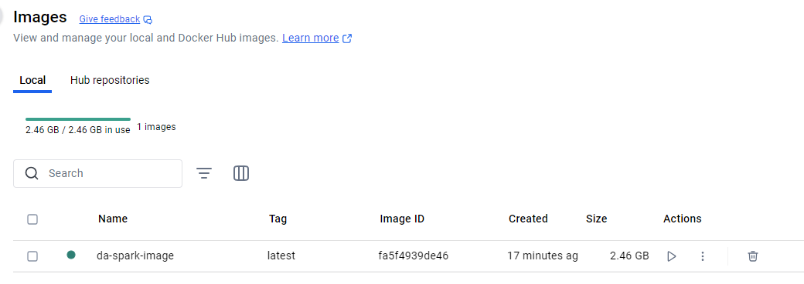
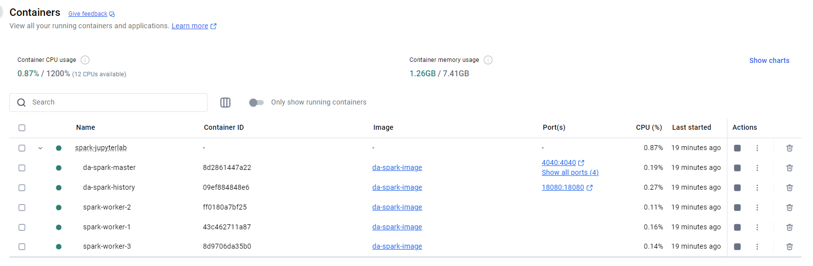
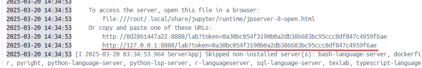
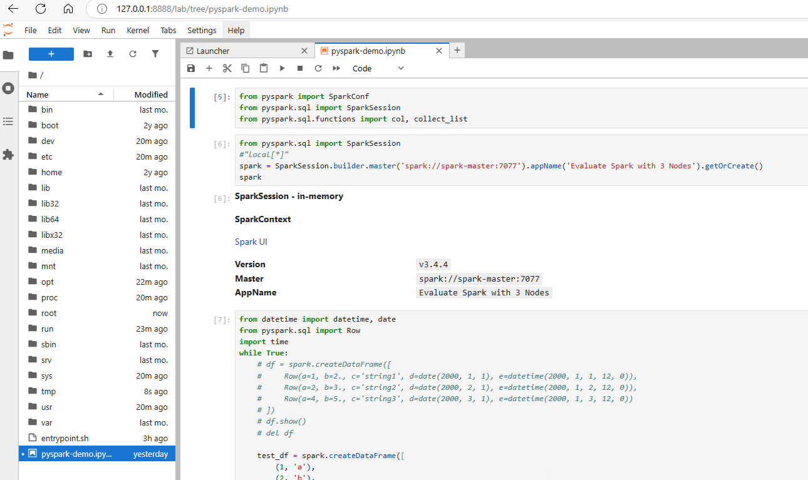
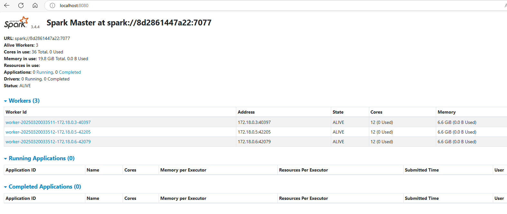
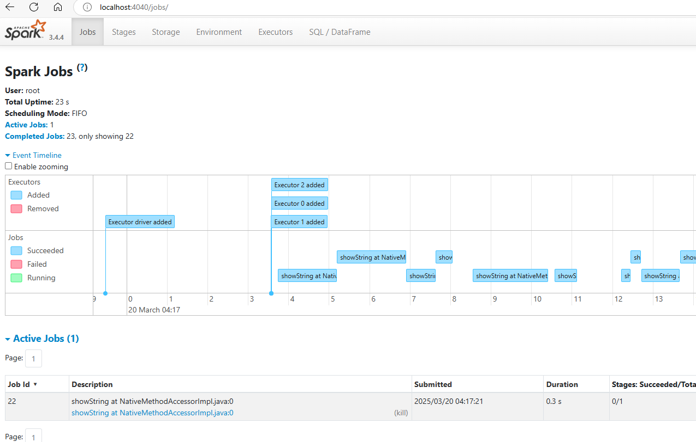
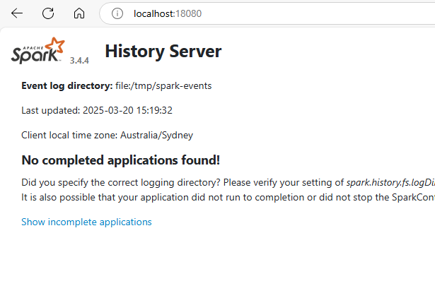

# Jupyterlab Pyspark Docker Image
This project composes a docker image of the following:

- [Multi-worker Apache Spark Setup (3.4.4)](https://spark.apache.org/downloads.html)
- [Jupyter Lab](https://jupyter.org/install)

Previously working with few popular images available in the docker repository had few shortcomings, like spark ran only in the [*Standalone Mode*](https://spark.apache.org/docs/latest/spark-standalone.html) and the version was outdated. This this led to compatiblity issues with new libraries and products coming up in the market.

Also being standalone mode, it was challenging to build and simulate complex problems on a multi-worker setup. 

## Description

This project comprises of the script [*Dockerfile*](https://docs.docker.com/reference/dockerfile/) and [*compose*](https://docs.docker.com/reference/compose-file/) to put together an image which allows to create your own docker image and run it with N number of workers in the spark via docker [scale](https://docs.docker.com/reference/cli/docker/compose/up/) option in compose

**Step 1: Build Docker Image**

>docker compose build

**Step 2: Run Docker Image with required spark workers (example: 3 below)**
>docker compose up --scale spark-worker=3

In this project, we build a single image file. And using the same we create the following containers:

- Spark Master Node + Jupyter Lab 
- Spark History Server
- Spark Worker 1..N based on the scale paramter

Refrence : [Setting up a Spark standalone cluster on Docker in layman terms](https://medium.com/@MarinAgli1/setting-up-a-spark-standalone-cluster-on-docker-in-layman-terms-8cbdc9fdd14b)

## Outcome
Once the image is built sucessfully and ran with the required number of workers, the user would be able to see the following:

**Image Build**

**Container Running**

**Jupyter Hub, with Sample Notebook connected to Spark Cluster**

**Note:** To access the Jupyter Lab you need to navigate to the Logs of the container *da-spark-master* to grab the URL highlighted in the screenshot below

**Apache Spark UI:** [http://localhost:8080/](http://localhost:8080/)

**Apache Spark Jobs UI** [http://localhost:4040/](http://localhost:4040/)

**Apache Spark History Server UI** [http://localhost:18080/](http://localhost:18080/)
